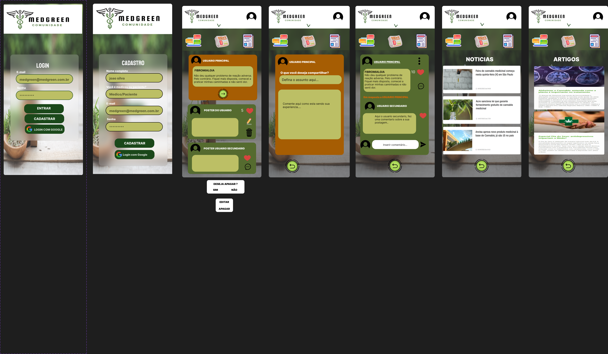

# Criando uma Rede Social

## Índice

* [1. Desenvolvedoras](#1-desenvolvedoras)
* [2. Resumo do projeto](#2-resumo-do-projeto)
* [3. Definição do produto](#3-definição-do-produto)
* [4. Histórias de usuário](#4-historias-de-usuario)
* [5. Testes de Usabilidade](#5-testes-de-usabilidade)
* [6. Prototipos](#6-prototipos)
* [7. Testes unitários](#7-testes-unitários)
* [8. Objetivos de Aprendizagem](#8-objetivos-de-aprendizagem)

***

## 1. Prefácio

O projeto MedGreen foi desenvolvido por:

* Emilaine Santos [GitHub](https://github.com/emilainesantos)
* Leticia
* Rafaela

* Link do projeto:

Bem-vindo a MedGreen, uma emocionante jornada em direção a Cura, onde usuarios que possuem doenças auto imunes e pessoas que querem entender do assunto para muitas vezes auxiliar quem tem a doença, compartilhem suas experiencia utilizando o oleo de canabidiol como tratamento para o alivio de sintomas causados.
Nossa visão era clara: Nossa intenção é fazer com oque essas pessoas conheça nova alternativas de tratamento e conheçam assim como também compartilhem suas experiencias, além de obter abar onde á comprovações cietificas e noticias da atualidade sobre o canabidiol em pró a saude.

Neste projeto, detalharemos como criamos esta plataforma incrível. Desde a concepção até a implementação, exploraremos como desenvolvemos uma Single-Page Application (SAP) com uma abordagem "mobile first", permitindo que você acesse a MedGreen de qualquer lugar e dispositivo.

Prepare-se para embarcar nesta jornada conosco e descubra como a MedGreen está tornando a vida  ainda mais especial!

## 2. Resumo do projeto

Á rede social Medgreen, é uma rede onde os usuarios possam compartilhar a experiencia de uso do oleo de canabidiol, para tratamento de doenças auto imunes e possam acessar a documentos de comprovacoes de doenças tratadas com canabidiol.

**Criar Conta e Logar-se:** Os usuários podem criar facilmente uma conta na MedGreen e fazer login para acessar todos os recursos da plataforma, bastando ser maior de idade.

**Compartilhar Momentos:** Os membros podem compartilhar suas experiencias e tirar duvidas com outras pessoas.

**Interagir com Publicações:** Os usuários podem criar, editar e deletar suas próprias publicações, bem como dar "likes" nas publicações de outros membros, promovendo a interação e a conexão.

**Single-Page Application (SAP):** A MedGreen é construída como uma Single-Page Application (SAP), garantindo uma experiência de usuário fluida e responsiva.

**Abordagem "Mobile First":** A plataforma é desenvolvida com uma abordagem "mobile first", tornando-a acessível e funcional em dispositivos móveis.

Além disso, a Medgreen não se limita apenas ao compartilhamento de momentos; ela também é uma fonte valiosa de informações sobre serviços, produtos e ONGs relacionadas a cura de doenças auto imunes, permitindo que os usuários descubram recursos úteis e apoiem causas importantes.

## 3. Definição do produto

**Quem são os principais usuários?**
Os principais usuários do oleo, são pessoas que portadoras de doenças auto imune.  

**Qual problema o produto resolve/para que ele serve para esses usuários?**
O produto resolve os seguintes problemas e atende às necessidades dos pais de pets:

1. Fornecimento de Informações Relevantes: troca de experiencia e seus processos de cura e diminuição dos sintomas gerados pela doença

2. Estabelecimento de uma Rede de Confiança: Estabelecimentos recomendados pela Anvisa, onde essas pessoas possam obter o oleo de forma segura.

## 4. Histórias de usuário

Para compreender as necessidades dos usuários, fizemos alguns testes para identificar o que eles desejam encontrar em uma rede social voltada cura e diminuição de efeitos causados pelas doenças, e com base nos resultados, elaboramos as seguintes histórias de usuário para ilustrar suas necessidades e expectativas.

*Tela de login/Cadastro*

"Como usuário de uma rede social, desejo ter a opção de realizar um cadastro seguro, onde meus dados estejam protegidos, e que eu possa ter a certeza de que as pessoas nessa rede também passaram por um processo de cadastro seguro."

"Como usuário de uma rede social, gostaria de ter a facilidade de fazer um cadastro simplificado utilizando minha conta do Google, para economizar tempo e esforço no processo de registro."

*Tela Feed

"Como usuário de uma rede social, quero poder compartilhar meus pensamentos e textos com facilidade, para que minha voz seja ouvida e minhas ideias compartilhadas com a comunidade."

"Como usuário de uma rede social, desejo uma timeline onde eu possa acompanhar as publicações de outras pessoas, para me manter atualizado sobre seus pensamentos, atividades e interesses."

"Como usuário de uma rede social, quero ter a capacidade de expressar meu interesse ou engajamento nas publicações das pessoas que sigo, através da opção de 'curtir', para mostrar meu apoio e apreço pelo conteúdo delas."

"Como usuário de uma rede social, gostaria de poder editar minhas publicações, caso eu precise corrigir erros de digitação ou atualizar informações, para manter meu conteúdo preciso e relevante."

"Como usuário de uma rede social, desejo ter a opção de excluir minhas publicações, caso eu queira remover conteúdo antigo ou indesejado, para manter meu perfil organizado e relevante."

## 5. Testes de Usabilidade

Para avaliar a experiência do usuário (UX) e a usabilidade da nossa aplicação, realizamos uma pesquisa detalhada que abordou diversos aspectos-chave da plataforma. Adotamos uma abordagem centrada no usuário, com ênfase nas seguintes áreas: a relevância da aplicação, a facilidade de registro e login, a simplicidade na criação de postagens, a presença de campos adequados e pertinentes nas postagens e a satisfação geral com o design da interface. Também encorajamos os usuários a relatar qualquer problema que encontrassem durante o uso da aplicação, bem como a compartilhar sugestões para melhorias. Esses insights foram cruciais para aprimorar a experiência dos nossos usuários, levando em consideração suas necessidades e expectativas.

Recebemos principalmente feedbacks positivos em relação à usabilidade, facilidade de uso e aparência da aplicação. Ela foi descrita como intuitiva, de fácil utilização, e o design visual recebeu elogios por ser limpo e amigável.

## 6. Prototipos 

### Alta fidelidade

*Figma[https://www.figma.com/file/o0RfDdHejV8P5wqP8nSEzV/GREENMED?type=design&node-id=0%3A1&mode=design&t=e6FqSUSkx7GTTgcM-1]

## 7. Testes unitários

* Lembre-se de que não há _setup_ de **testes** definido, isso dependerá da
  estrutura do seu projeto. Você não deve esquecer de pensar sobre os testes.
  Eles podem ajudar a definir a estrutura e sua lógica.

* Os testes de unidade devem cobrir no mínimo 70% de _statements_, _functions_,
  _lines_ e _branches_.

## 8. Objetivos de Aprendizagem

✓ Uso de HTML semântico

✓ Uso de seletores de CSS

✓ Uso de seletores de DOM

✓ Manipulação de eventos de DOM (listeners, propagação, delegação)

✓ Variáveis (declaração, atribuição, escopo)

✓ Single Page Application (SPA)

✓ Testes assíncronos

✓ Uso de mocks e espiões

✓ Firebase

✓ Firestore